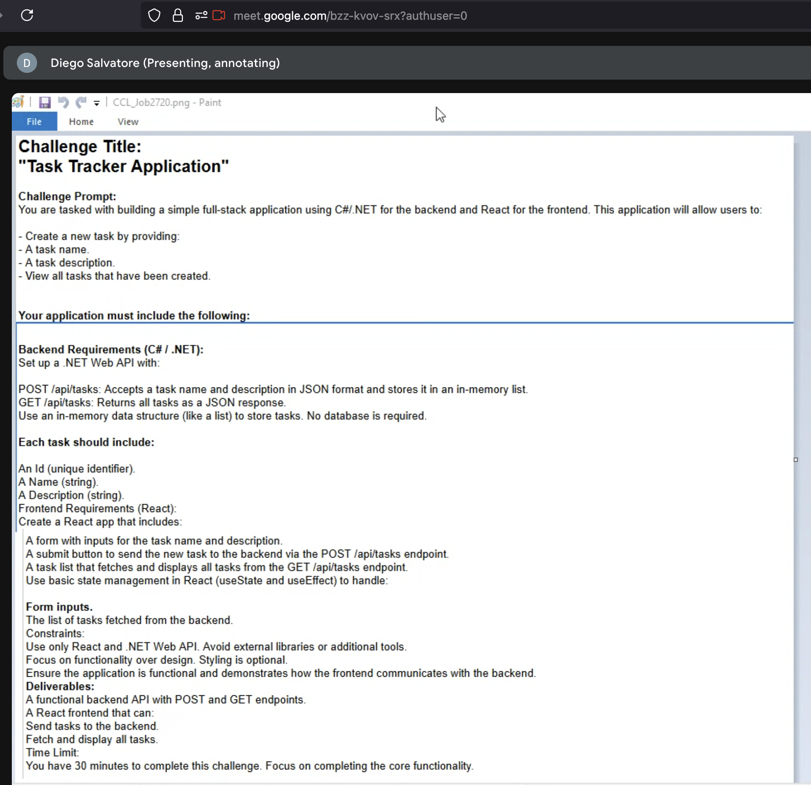
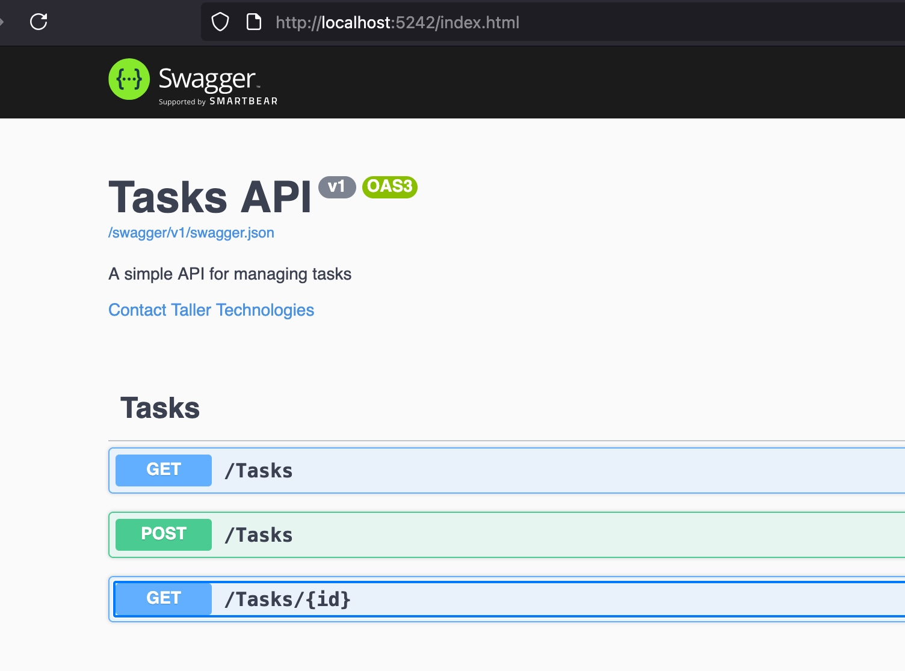
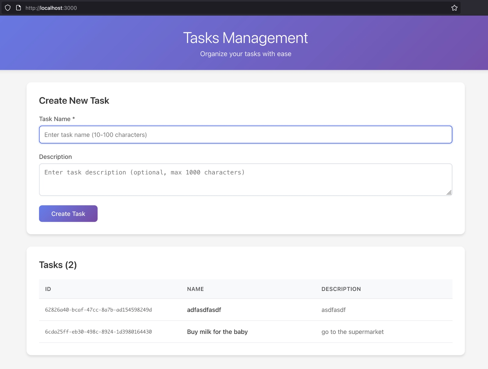

# .NET &amp; React Challenge from tallertechnologies

## Instructions


## How to run?
### Backend
```
cd back/TasksApi
dotnet run
```

Open a browser window using address [http://localhost:5242/index.html](http://localhost:5242/index.html) to see the Swagger UI.


### Frontend
1. Link BaseURL: After running the backend you should see the base url within the console, like `http://localhost:5242`. Take note of it (let's call that value BACKEND_ROOT).
2. Go to `~/front/src/services/taskApi.ts` file and make sure the line `const API_BASE_URL = 'http://localhost:5242/tasks';` points to the same base URL. It's formed from expression `BACKEND_ROOT/tasks`
2. Run the following commands
```
npm i
npm build
npm start
```
3. Navigate to [http://localhost:3000](http://localhost:3000)
4. You should see something like the following, but tasks in the lower panel. After adding some tasks you should see those below.
